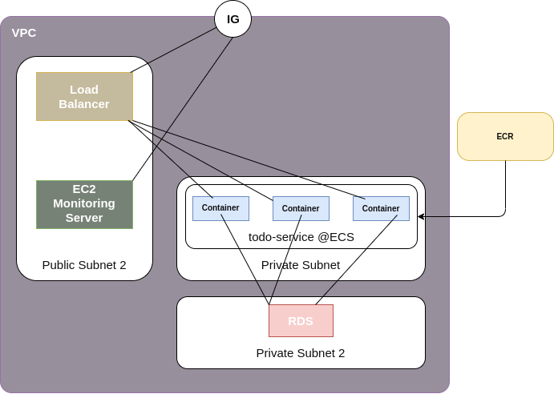

# Todo App
##### By: Ali Hamouda


## Description
This is a NestJs Todo Demo REST app with CI/CD workflow.
AWS native solution.

## Repo Description
#### Infrastructure Folder

Contains the desired infrastructure of the deployed app. This description is made using AWS CDK.

#### Monitoring Folder

Has scripts for Monitoring Server configuration. Let's user install Grafana and Prometheus on EC2 instance automatically deployed using CDK files.

#### SRC

Contains the app source code.

## Requirements
* AWS account
* AWS CLI installed on host machine
* .aws/credentials configured
* NodeJs installed on machine
* NestJs installed if code is going to run on dev environment
* Python3 installed
* Ubuntu as scripts are made for Ubuntu machine
* Docker and Docker-compose
* Gmail Email for Grafana Alerting

## Philosophy of the project
This project introduces peaple and users to NestJs development, testing, containerization using Docker, Continuos Integration using Github Actions Workflows, Continuos Delivery using AWS Elastic Container Service a.k.a ECS.

Feel free to fork, change and use the content of this repository.

## Steps for running this solution


> I assume here that awscli is well configured and node is installed

### Deploy Infrastructure on AWS

We need first to store a secret in the AWS. Why? What is it? well it's the database password we gonne use later.

```bash
aws secretsmanager create-secret --name rds/todo-app  -secret-string <SECRET_PASSWORD>

> OUTPUT
> {
>   "ARN": "arn:aws:secretsmanager:AZ:user-id:secret:name_here-vJIkpB",
>   "Name": "name_here",
>   "VersionId": "50XXX15d-8cb7-XXXX-XXXX-XXXXXe21a4ad"
> }

```
Copy that ARN inside **./infrastructure/infrastructure-builder.sh** line 6 to replace existing ARN.

Then, we need to build the python app for IaC deployment.

```bash
cd infrastructure
chmod +x infrastructure-builder.sh
./infrastructure-builder.sh
# This will ask you for aws region and account id : a 12-digit number
```

This will create a new folder under infrastructure called *ecs-devops-todo-cdk*

Next we run the project:

```bash
cd ecs-devops-todo-cdk
cdk deploy
```

After a certain amount of time, the project would normally be deployed.

#### For Rollback:
To rollback this step, you need to to run 
```bash
cdk destroy
```
Then log in to your AWS account and delete the ECR repository and LogGroup under CloudWatch.

### Monitoring Solution Deployment

> You can start this step even if the **cdk deploy** didn't finish yet.

On AWS create a keypair and call it ec2nkp.pem.
Place it in ~/Downloads/.

On terminal, get back to main directory **Todo-app** :
```bash
cd ../..
```

And get to *monitoring-scripts* folder:
```bash
cd monitoring-scripts

# you need to edit ./grafana/alert-conf.json
# change my emails with yours to receive alerts
...

sudo chmod +x installation-trigger.sh
./installation-trigger.sh
# This will ask for a Grafana (Dashboard) Password, email and password
# The email and password will let Grafana send alerts
# SMTP server are already configured for Gmail
```
The script will loop until EC2 Instance ( for monitoring ) is deployed.
Then it will connect and execute a custom script.
You can use your browser to connect to EC2 instance on ports for:
|ports|service|
|-----|-------|
|80| Grafana|
|8080|Prometheus|

No data is provided for Prometheus, thus Grafana, as container is not deployed yet on ECS.

### Prepare AWS Deployement Workflow

Go to your Github Repository of this project.
Set secrets by choosing settings-> secrets as belows:
#### For AWS Educate Accounts:
|Secret Name | Content |
|--|--|
|AWS_ACCESS_KEY_ID|Available in aws credentials|
|AWS_SECRET_ACCESS_KEY|Available in aws credentials|
|AWS_SESSION_TOKEN|Available in aws credentials: required by the AWS Educate Account|
|DB_PASSWORD|DB password set in previous step as secret (not its ARN)|


> For normal account: you need to edit the workflow and remove AWS_SESSION_TOKEN Input

After adding secrets, we need to run the AWS workflow in github actions:
Steps will be executed automatically and solution will be deployed.

Get back to Grafana, *GetCount* will be set to 0.

## Solution Architecture

* IG: Internet Gateway


## Workflow
### CI Workflow
### CD Workflow
## ToDo